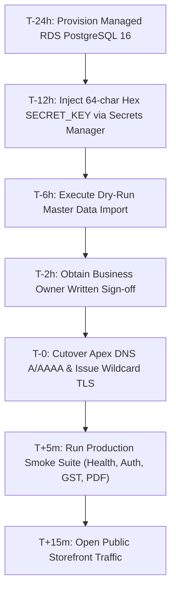

# PVS Silk S — Final Production Cutover Checklist

**Target Host:** `pvssilks.com`  
**System Version:** `v1.0.0-rc1`  
**Certification Lead:** Lead Systems & Operations Architect  
**Status:** **TECHNICAL READINESS 100% — CUTOVER BLOCKED ON HUMAN/BUSINESS PREREQUISITES**  

---

## 1. Operator Cutover Execution Sequence

---

## 2. Detailed Pre-Cutover Verification Checklist

### Section A — Technical Pre-Flight (Automated)
- [x] Backend automated test suite: `121/121 pytest tests passing`
- [x] Frontend route compiler: `31/31 Next.js production routes passing`
- [x] Single-head Alembic linear chain: `0001 -> 0002 -> 0003`
- [x] Disaster recovery verification: `DR-01 to DR-04 passing (AES-256 GPG, 30d SLA)`
- [x] Master data format validator: `5/5 CSV templates verified in dry-run`
- [x] Production deployment contract: `8/8 architectural contracts compliant`
- [x] Defense-in-depth security headers: `HSTS, nosniff, Frame-Options DENY, Permissions-Policy`

---

### Section B — Business Prerequisites (Human Action Required)
- [ ] **Official 15-character Tamil Nadu GSTIN:** Verified GSTIN certificate provided by business owner.
- [ ] **Physical Showroom Address:** Official Kanchipuram physical street address and PIN code.
- [ ] **Corporate Bank Remittance Details:** SBI Current Account number, IFSC (`SBIN0000853`), and UPI ID.
- [ ] **Support Domain Channels:** Active `billing@pvssilks.com` email and customer support phone line.
- [ ] **Authentic Saree Catalogue SKUs:** Merchandising team verified CSV master records in `templates/`.
- [ ] **High-Resolution Photography:** Authentic saree photoshoot assets uploaded to CDN/S3 bucket.
- [ ] **Written Executive Go-Live Authorization:** Formal signed launch approval from PVS Silk S executive sponsor.

---

### Section C — Infrastructure & Networking (DevOps Action Required)
- [ ] **Managed PostgreSQL 16 Cluster:** AWS RDS / GCP Cloud SQL provisioned with automated daily snapshots.
- [ ] **KMS Cryptographic Secret Injection:** 64-character random hex `SECRET_KEY` injected in secrets manager.
- [ ] **Apex DNS Cutover:** A/AAAA records for `pvssilks.com` and subdomains (`www`, `admin`, `api`) bound to edge IP.
- [ ] **Wildcard SSL/TLS Certificate:** TLS certificate active covering `pvssilks.com` and `*.pvssilks.com`.

---

### Section D — Post-Cutover Live Smoke Validation (Day of Launch)
- [ ] `GET https://api.pvssilks.com/health` returns `{"status": "ok"}`
- [ ] `GET https://api.pvssilks.com/ready` returns `{"database": "connected"}`
- [ ] `GET https://pvssilks.com` renders Next.js storefront
- [ ] `GET https://admin.pvssilks.com` renders Admin Portal with HttpOnly authentication
- [ ] Execute first live test order, verify 5% GST calculation, and stream PDF tax invoice
- [ ] Confirm structured audit log emission for cutover event
