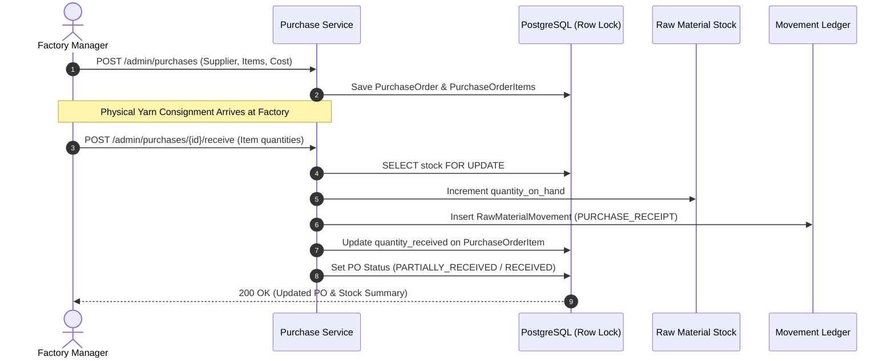

# PVS Silk S — Purchasing & Material Receiving Operations

## 1. Purchasing Workflow & Procurement Cycle

The complete lifecycle connects suppliers to warehouse inventory:

$$\text{Supplier Registration} \longrightarrow \text{Draft Purchase Order} \longrightarrow \text{PO Confirmation} \longrightarrow \text{Consignment Receipt} \longrightarrow \text{Atomic Stock Credit} \longrightarrow \text{Audit Movement Entry}$$

---

## 2. Purchase Order Data Model

### 2.1 Purchase Orders (`purchase_orders`)
* `id` (UUID, PK)
* `po_number` (VARCHAR(50), UNIQUE, e.g. `PVS-PO-10492`)
* `supplier_id` (UUID, FK `suppliers.id`)
* `status` (`DRAFT`, `ORDERED`, `PARTIALLY_RECEIVED`, `RECEIVED`, `CANCELLED`)
* `order_date` (DATE)
* `expected_delivery_date` (DATE, optional)
* `subtotal_amount` (NUMERIC(12,2), server-side computed)
* `tax_amount` (NUMERIC(10,2), GST component)
* `total_amount` (NUMERIC(12,2), subtotal + tax)
* `notes` (TEXT, delivery/quality terms)
* `created_by_user_id` (UUID, FK `users.id`)

### 2.2 Purchase Order Items (`purchase_order_items`)
* `id` (UUID, PK)
* `purchase_order_id` (UUID, FK `purchase_orders.id`, CASCADE)
* `raw_material_id` (UUID, FK `raw_materials.id`)
* `quantity_ordered` (NUMERIC(12,2))
* `quantity_received` (NUMERIC(12,2), default 0)
* `unit_cost` (NUMERIC(10,2), purchasing rate per unit)
* `line_total` (NUMERIC(12,2), server-side computed)

---

## 3. Material Receiving & Duplicate Prevention

1. **Over-receiving Prevention:** The system validates that `quantity_to_receive <= (quantity_ordered - quantity_received)`. Attempting to receive more than the pending quantity raises a `409 Conflict`.
2. **Atomic Inventory Crediting:** The target `RawMaterialStock` row is locked (`SELECT ... FOR UPDATE`), `quantity_on_hand` is incremented, and `last_restocked_at` is updated.
3. **Reference Traceability:** An immutable movement record is logged with `reference_id = f"PO-{po_number}"` linking the stock increment to the purchase order.
4. **Automated Status Transition:** When all line items have `quantity_received >= quantity_ordered`, the purchase order status is automatically transitioned to `RECEIVED`.
